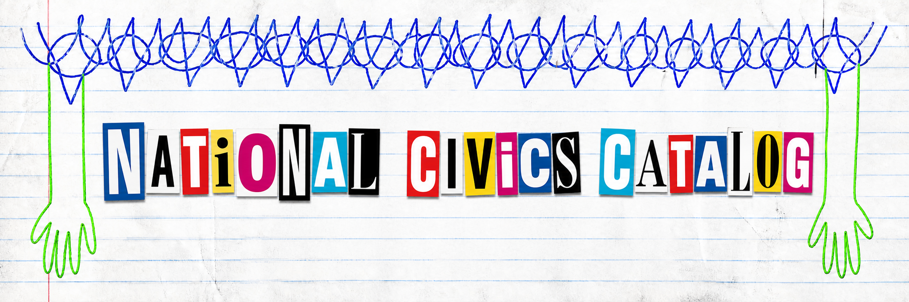

<p align="center">
  
</p>

# National Civics Catalog

National Civics Catalog lists U.S. public bodies and the official or authorized pages they use to publish meeting information. Records without an identified source remain visible as `needs_source` instead of being omitted.

It does not contain individual meetings, agendas, minutes, recordings, transcripts, summaries, or parser code.

## Current snapshot

The repository contains **38,707 catalog entries** across every U.S. state, the District of Columbia, and the five inhabited territories.

- **21,319 entries contain identified meeting-source endpoints.**
- **20,085 of those endpoints have completed an initial review.**
- **1,234 are clearly marked `unverified` while review is pending.**
- **17,388 entries are intentional research placeholders** with `status: "needs_source"` and no claimed endpoint.

The placeholders are part of the product. They preserve the national roster and a stable record shape while the catalog is filled in. They should not be read as discovered sources or working links.

> ### Transparency: where no continuing source was found
>
> Of the **17,388 current `needs_source` records**, **17,383 matched** a government in the Census Bureau's 2022 Government Units Listing. Among those matched records, **91.4% have populations below 5,000**, and the median population is **381**. Five state-level records did not have a population value in the matched Census worksheet.
>
> “No qualifying source found” does not mean that the government is inactive or holds no meetings. It means that no recurring first-party or demonstrably authorized online calendar, agenda or minutes index, public-notice page, feed, API, or meeting portal passed the catalog's evidence rules. Population figures come from the Census Bureau's 2022 Government Units Listing and are primarily 2021 estimates.

The starting roster comes from the U.S. Census Bureau's 2022 Government Units Listing and covers active state, county, municipal, and township governments. It is a foundation, not a claim that every Tribal government, civic body, unincorporated community, special district, or newer government is already represented.

## Browse the catalog

State and territory files are newline-delimited JSON:

```text
states/
  az.jsonl
  ca.jsonl
  dc.jsonl
  ny.jsonl
```

Each line is one catalog entry. Records are sorted by `source_id`.

A source spanning more than one state is stored once under the alphabetically first state code in its `state_codes` list. Consumers should use each record's full `state_codes` and `covers` values rather than treating its filename as its only geography.

## Understand a record

Every entry uses the structure defined in [`schema.json`](schema.json). Important fields include:

- `source_id`: stable identifier for the catalog entry;
- `publisher_name` and `publisher_type`: the body publishing or authorizing the source;
- `state_codes` and `county_names`: geographic placement;
- `url`: the continuing meeting source, or `null` while research is incomplete;
- `endpoint_type`, `platform`, and `access_method`: what kind of source it is and how it is published;
- `status`: its current research or review state;
- `last_checked` and `provenance_url`: when it was checked and the first-party evidence supporting it; and
- `covers`: the places or jurisdictions represented by the source.

The most important status distinction is:

- `needs_source` means the national roster entry exists, but no continuing source has been identified yet.
- `unverified` means an endpoint has been identified but has not completed ordinary catalog review.
- `working`, `empty`, `blocked`, `broken`, `moved`, and `retired` describe the result of a completed check.

Inclusion means the URL is first-party to, or an authorized service for, the named publisher. It does not establish legal authority, endorsement, completeness, or continuing availability.

## Build with it

The JSONL files can be loaded with ordinary command-line tools, Python, JavaScript, databases, and data notebooks. For example, this Python snippet reads only entries that currently contain an endpoint:

```python
import json
from pathlib import Path

sources = []
for state_file in Path("states").glob("*.jsonl"):
    for line in state_file.read_text(encoding="utf-8").splitlines():
        record = json.loads(line)
        if record["url"] is not None:
            sources.append(record)

print(f"Loaded {len(sources)} identified endpoints")
```

Catalog material released under CC0 may be copied, combined, redistributed, or used in commercial and noncommercial projects without separate permission.

## Methodology

The catalog was built by deriving a complete government roster first, then
researching and independently reviewing continuing meeting sources without
removing unresolved governments. See the [human-readable methodology](methodology/README.md)
or give [RESPAWN.md](methodology/RESPAWN.md) to an AI to adapt the process for
another country.

## Using linked material

The catalog's CC0 dedication covers the catalog material that ScootSolute LLC and contributors have the right to dedicate. It does not grant rights to records, documents, media, software, personal information, or other content available through the sources it identifies.

Rules governing access, reproduction, redistribution, and commercial use of linked material may differ by source and jurisdiction, including under applicable federal, state, Tribal, territorial, or local law and the source's own terms. Before using linked material—especially commercially—users are responsible for determining and complying with any applicable laws, licenses, terms, privacy obligations, and permission requirements. This notice provides general information only, not legal advice; consult a qualified attorney about a specific use.

## Relationship to Z-SPAN

[Z-SPAN](https://zspan.org) is a separate application that turns civic meeting sources into a public virtual library. Z-SPAN maintains its parsers and application code in its own repository. National Civics Catalog remains application-agnostic and contains only the source roster and its metadata.

## Contribute

Factual source suggestions, data corrections, and focused pull requests are welcome. The GitHub issue forms collect the public evidence needed to update an entry without requiring contributors to edit code.

If you are comfortable editing JSON, you can fill an existing `needs_source` placeholder or correct an entry directly in its [`states/`](states/) file. The contribution guide explains the record rules, catalog boundaries, local validation command, and licensing terms: see [`CONTRIBUTING.md`](CONTRIBUTING.md).

[`AI_CONTRIBUTOR.md`](AI_CONTRIBUTOR.md) provides a copy-and-paste workflow for using an AI coding assistant to research a place, validate the proposed record, and prepare a pull request.

Contributors are credited through Git history. Catalog contributions are released under CC0 so that everyone can reuse them freely; supporting software contributions are released under the MIT License. Contributing does not create ownership or control of the catalog.

## Maintenance

ScootSolute LLC maintains and reviews the catalog with help from contributors. Identified endpoints submitted from outside the maintainer's completed review process enter as `unverified` until their evidence and behavior have been checked.

## License

ScootSolute LLC has released the catalog data, schema, metadata, documentation, and any protectable selection or arrangement it owns under the [CC0 1.0 Universal public-domain dedication](LICENSE). These materials may be used for any purpose, including commercial products, without separate permission or required attribution.

Supporting software and workflow code under [`.github/scripts/`](.github/scripts/) and [`.github/workflows/`](.github/workflows/) is available under the [MIT License](LICENSE-MIT).

CC0 applies only to rights ScootSolute LLC and contributors can legally dedicate. Government facts, public URLs, linked content, and third-party material remain subject to applicable law and their source terms. CC0 does not grant trademark rights in the National Civics Catalog name or other branding. See [`NOTICE`](NOTICE) and [`THIRD_PARTY_NOTICES.md`](THIRD_PARTY_NOTICES.md).
